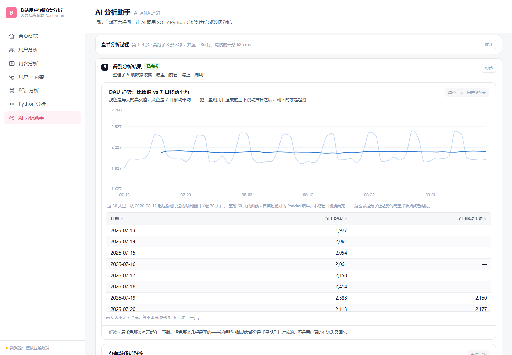
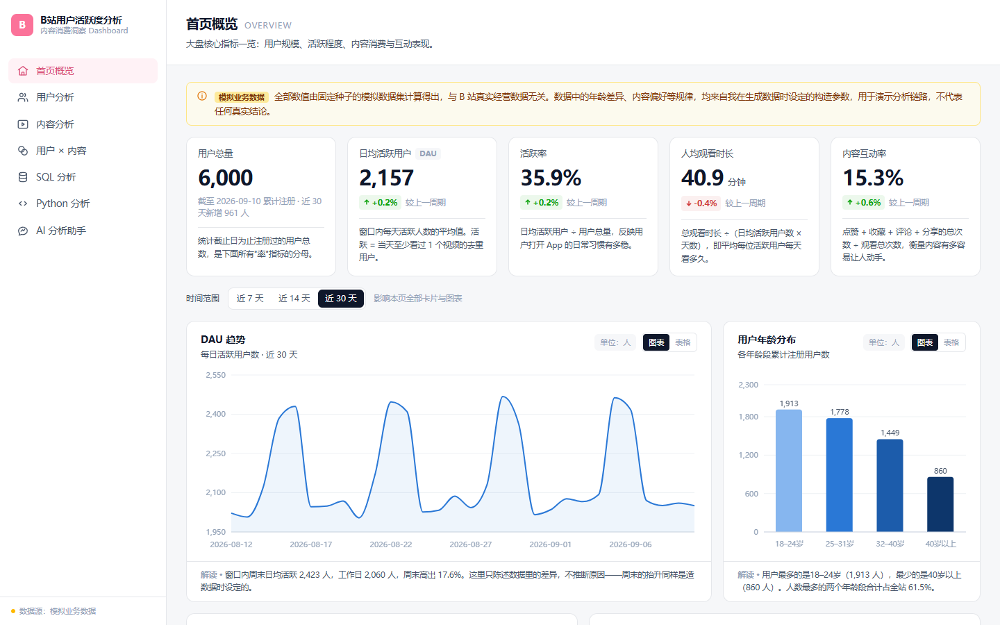
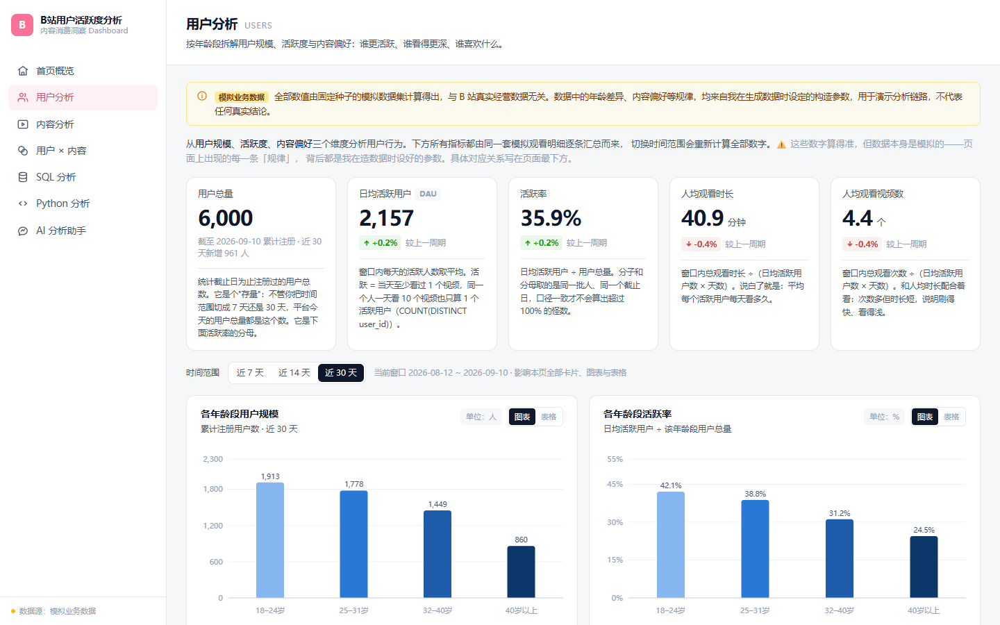
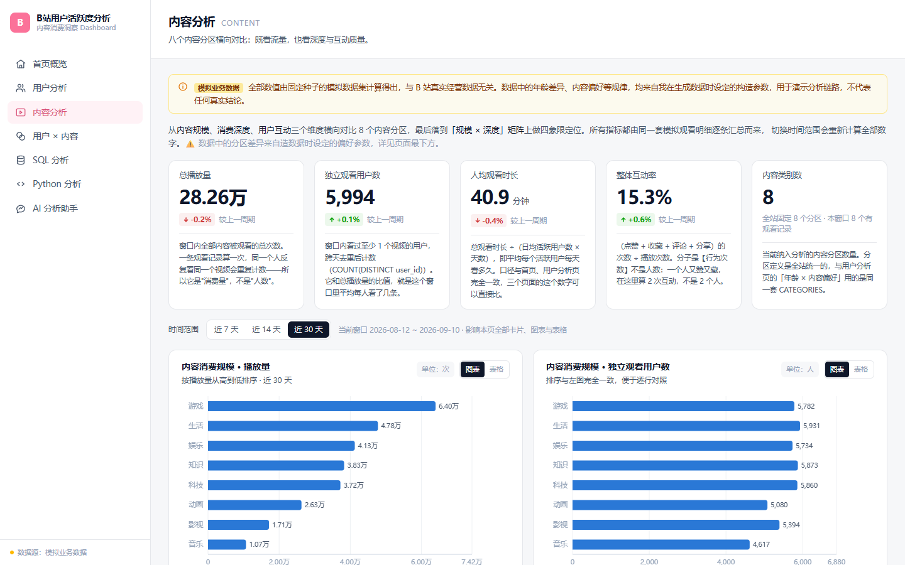
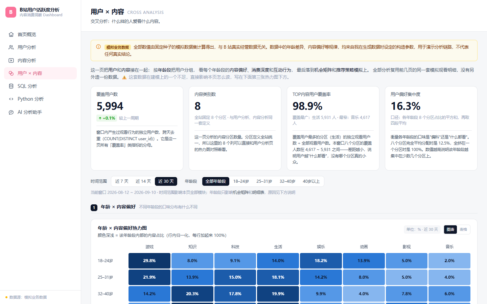
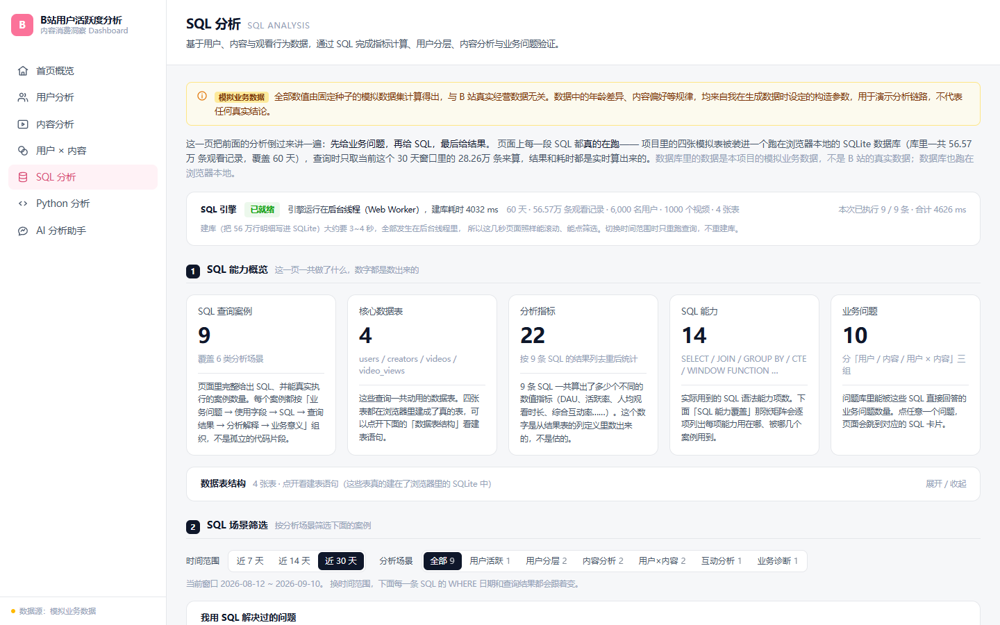
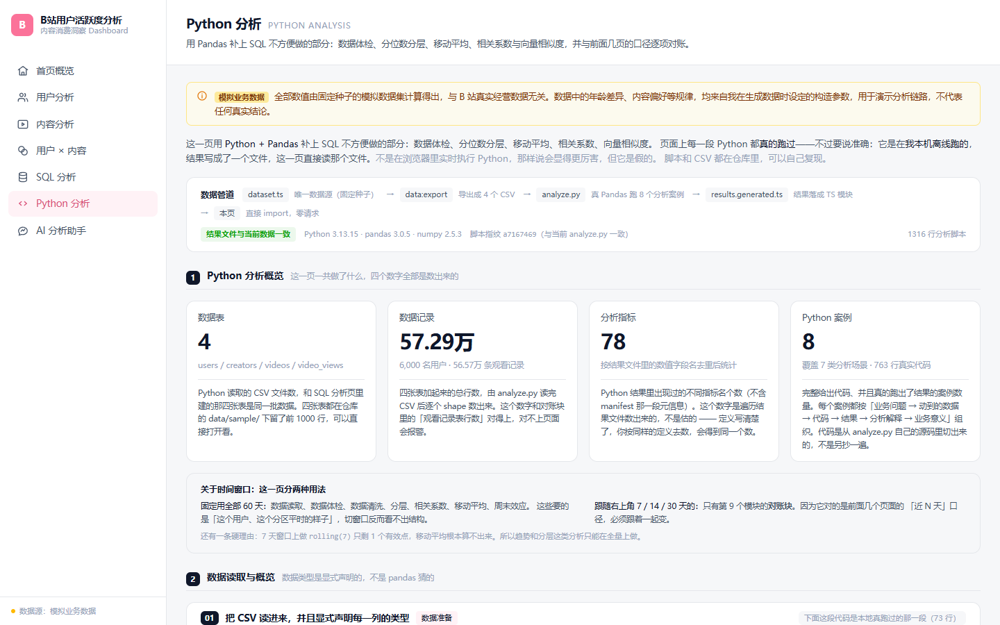

# B站用户活跃度与内容消费分析 Dashboard

**一个跑在浏览器里的数据分析产品：7 个分析页面 + 1 个能自然语言提问的 AI 数据分析助手。**

从「定义业务问题 → 搭建指标体系 → 取数 → 分析 → 可视化 → 输出业务判断」完整走一遍，
并把最后一页做成一个**真调大模型、真跑 SQL、并且能说清自己哪里不靠谱**的 AI 分析师。

[▶ Live Demo](https://zhw866346.github.io/bilibili-dashboard/) ·
[产品设计](docs/product-design.md) ·
[AI 架构](docs/ai-architecture.md) ·
[Bad Cases](docs/bad-cases.md)

> **不用下载代码、不用配置环境、不用注册登录** —— 点开就能用。
> 7 个页面里 6 个功能完整；AI 分析助手页在线上走等价的规则路径，
> 原因和「怎么在自己电脑上跑真的调大模型那一版」都写在下面
> [项目边界](#项目边界)一节。

---

## 项目概览

| | |
|---|---|
| **是什么** | 面向数据分析 / 商业分析 / 数据产品 / AI 产品岗位的个人作品集项目 |
| **业务场景** | 一个视频社区的用户活跃度与内容消费 |
| **数据** | **全部为模拟数据**，固定随机种子生成，与哔哩哔哩真实数据无关 |
| **规模** | 6,000 用户 / 1,000 视频 / 60 天 / 565,740 条观看记录 |
| **成品** | 7 个页面 · 9 个真实执行的 SQL 案例 · 11 个真 Pandas 分析模块 · 1 个 AI 分析助手 |
| **状态** | 已冻结的 MVP（不再扩展功能，只做作品集整理） |

**这个项目的重点不是 7 个图表页，是最后那一页的 AI 分析师。**
图表页要证明的是「分析链路是通的」；AI 那一页要证明的是另一件事 ——
**一个大模型驱动的分析功能，怎么才能让人相信屏幕上那句话。**

---

## 核心产品截图

### AI 分析助手 —— 本项目的核心



自然语言提问 → 模型自己决定查什么 → 在你自己的浏览器里真跑 SQL → 写出结论。
**结论里的每一个数字，都要能在工具返回的结果里找到出处**，找不到的会被单独列出来。

### 首页概览



大盘核心指标：DAU、人均观看时长、互动率，以及 DAU 趋势、年龄分布、分区表现。

### 用户分析



按年龄段拆解用户规模、活跃率与内容偏好。

### 内容分析



八个内容分区横向对比，既看流量也看消费深度与互动质量。

### 用户 × 内容



交叉分析：什么样的人爱看什么内容，含机会象限矩阵。

### SQL 分析



9 个**在浏览器里真实执行**的 SQL 案例，含 CTE 与窗口函数。

### Python 分析



离线跑**真 Pandas** 得到的结果，附带与前端逐项对账。

---

## AI 助手：一次提问走完的六步

```
用户提问
   │
   ├─ 意图    模型理解「问的是什么」—— 它只能【申报】，不能改系统状态
   ├─ 选工具  模型自己决定调哪个（SQL / Python）、自己决定要不要再查一次
   ├─ 执行    SQL 在你自己的浏览器里真跑；Python 起的是本机真进程
   ├─ 校验    数字核对器逐个数 —— 结论里每个数字都要能在工具结果里找到出处
   ├─ 作答    拿走工具，强制模型给结构化 JSON
   └─ 呈现    结论 + 依据 + 数据出处；核对不过的原样列出来给人看
```

> 这张图画的是**大模型路**，也是线上 Demo 走不了的那一路（原因见下方「线上 Demo 少了哪一路」）。
> 线上走的是**规则路**：问题理解和写结论在本地用关键词 + 模板完成，
> 上面六步里只有「执行」和「呈现」原样还在。

---

## 核心功能

**① 七个分析页面，一条完整的分析链路**

口径写在代码里、SQL 现场真跑、Python 真跑、每个结论都有数据支撑。
数据分三层（造明细 → 算口径 → 拼页面形状），页面只负责「怎么画」，不负责「怎么算」，
任何一个数字对不上都能顺着这三层找出来。

**② 一个真调大模型的 AI 数据分析助手**

模型自己写 SQL、自己决定要不要再查一次、自己写结论 —— 不是模板填空。
它能接住多轮追问：「**最近 7 天呢**」「**和 25-31 相比呢**」「**他们**最喜欢什么内容」。

**③ 三层「防 AI 胡说」机制 —— 全部是代码，不是提示词**

| 机制 | 拦什么 |
|---|---|
| **数字核对器** | 结论里出现找不到出处的数字，原样列出来由人核对 |
| **时间窗口一致性检查** | 模型嘴上说的窗口和这一轮真正跑的窗口对不上 |
| **对比对象丢失检查** | 多轮追问里主分析对象或对比对象被悄悄覆盖 |

**④ 贯穿全站的诚实性设计**

每个页面常驻模拟数据提示；首页和用户分析页底部有一块「这份数据是怎么来的」，
逐条列出「页面上的哪个差异 ←→ 代码里的哪个参数 ←→ 设的值是什么」，
数值直接从生成参数读出，不是手抄的。

---

## 我的工作

这个项目由我主导产品设计与决策，代码实现借助 AI 辅助完成。具体分工：

### 我主导

- **业务问题定义** —— 这个场景下真正该被回答的是哪几类问题
- **需求拆解** —— 把「做一个数据看板」拆成 7 个页面 + 1 个 AI 助手，以及它们的先后顺序
- **指标体系** —— 规模 / 活跃 / 消费 / 互动四层，以及两条口径纪律（哪些能相加、哪些必须先做去重）
- **产品结构** —— 数据分三层、页面只读 selectors、加新指标不绕过这一层
- **Dashboard 设计** —— 每个页面放哪些指标、用什么图、为什么用二维矩阵而不是排名表
- **AI 功能设计** —— 两阶段循环、工具定义、意图与执行解耦、上下文与状态的存法
- **测试验收** —— 四层验收的设计、五个 CASE 的判据（每一问都写清「失败时屏幕上是什么样」）
- **Bad Case 分析** —— 逐个定性、定严重度、判断该修还是该记
- **产品迭代决策** —— 包括决定「在哪里停下」

### AI Coding 辅助

- 代码实现、Debug、重构、部分工程实现

> ★ 这个项目**没有隐藏 AI Coding**。
> 但产品判断、范围取舍和验证标准是我定的 —— 比如「换窗口之后**不自动重跑**」、
> 「比较是增维不是覆盖」、「系统状态优先于模型叙述」这三条决定产品形态的决策，
> 以及「哪些能力这一版不做」。
> 完整的决策理由见 [产品设计](docs/product-design.md)。

---

## AI 产品设计亮点

### 亮点一：意图与执行分开 —— 模型可以改变建议，不能改变事实

用户追问「最近 7 天呢」时，模型只负责**理解意图**，然后申报一个它认为用户想要的天数。
系统读到之后**只把按钮拨过去，绝不自动重跑**。

**结果卡片上的「时间范围」永远写着这一轮真正跑的天数** —— 按钮动了，它不会跟着变。
屏幕上会出现一条横幅，说清「按钮已经拨过去了，但下面这份结果还是旧窗口的」。

> ★ 一句话：**「按钮变了」不等于「数据查过了」，这个区别必须让用户看得见。**

### 亮点二：比较是「新增一个维度」，不是「覆盖当前对象」

用户问「哪个年龄段 DAU 最高？」→「和 25-31 相比呢？」
第二问**不应该**把「18-24」冲掉，而应该变成**两行都有的上下文**。

这是多轮对话里最容易被悄悄搞坏的一件事：用户以为自己在「再加一个维度」，
系统却在「换一个对象」—— 而**两种情况的界面看起来一模一样**，不报错，只是答非所问。

### 亮点三：系统状态优先于模型叙述

当模型说的话和系统的状态冲突时，**以系统状态为准，并且把冲突显示出来** ——
不是去「调和」它，更不是让模型的话覆盖掉系统状态。

三样防错机制都是**独立的代码在检查模型的输出**，而不是让模型自检。
**让模型自检，等于让被检查的人自己写检查报告。**

> ★ 这条要防的是最坏的一种失败：**模型说了什么，系统就假装执行了什么。**

### 亮点四：有些失败不报错，只是说了一句听起来很合理的话

这个项目记录的二十多个真实问题里，**绝大多数不是「功能跑不起来」，
而是「功能跑起来了，但它说了一句不准确的话」**。

这类失败有一个共同的形状 —— 不报错、不抛异常，产出的东西通顺、合理、看起来完全正常。
五条最有代表性的记录在 [Bad Cases](docs/bad-cases.md) 里。

---

## 技术栈

| 层面 | 选型 | 说明 |
|---|---|---|
| 框架 | React 19 + TypeScript | TypeScript 约束数据结构，字段写错时立刻报错 |
| 构建 | Vite 8 | |
| 样式 | Tailwind CSS 4 | |
| 图表 | Recharts 3 | 基于 SVG |
| 路由 | React Router 7（Hash 模式） | Hash 路由让 `file://` 下也能直接打开 |
| SQL 引擎 | sql.js（SQLite → WebAssembly） | 跑在浏览器 Web Worker 里，全量数据不出本机 |
| 本机后端 | Node 内置模块，**零新增依赖** | 只做两件事：转发给大模型、调本机 Python |

**可视化上做过的事**：配色经过色盲安全校验、颜色不单独承载信息（对比度低的一律直接标数值）、
每张图都提供表格视图、每张图配一句「怎么读」而不是只给图例。

---

## 项目边界

这一节如实说明**哪些是真的、哪些是刻意没做的**。

### 线上 Demo 少了哪一路

Live Demo 部署在静态托管上，**背后刻意没有后端**。所以 AI 助手页在线上：

- ✅ 能提问、能出结论、**每条 SQL 都在你的浏览器里真跑**；
- ⚠️ 只是把「让大模型自己写 SQL」换成了等价的**本地规则 + 模板**，页面横幅会如实写明走的是哪条路。

**为什么那个服务不能放到网上**：API Key 一旦跟着网站部署到公网，
任何人都能拿它刷爆账号额度，账单算在作者头上。

> ★ **这是设计，不是故障。** 但必须讲清楚，否则点开 Live Demo 会以为部署坏了。

### 数据边界

**全部数据都是模拟的**，由固定随机种子生成，与哔哩哔哩的真实经营数据毫无关系。

★ 比这更要紧的一句：**数据里的「规律」是设定出来的，不是发现的。**
页面上每一条「规律」都是生成数据时先设定好参数、再让数据体现出来的。
所以这些图表能证明的是「**分析链路是通的**」，不能作为任何真实业务判断的依据。

**仓库里的 `data/sample/` 是什么**：每张表**各前 1000 行**的小样本，**同样是模拟数据**。
放它在仓库里，是为了让人不下载 21MB 全量数据也能看懂表结构和字段含义。
全量 CSV 由 `npm run data:export` 现场生成、**不入库** —— 留着它就等于在仓库里放第二份数据，
改种子时必然忘记同步，而「两份数据不一致」正好是这个项目最怕的事。

### 能力边界（主动没做的）

不支持任意日期区间（只能做等长窗口比较）、历史只带最近 3 轮、没有自动下钻、
没有长期记忆、不引 RAG / MCP / Multi-Agent。

这是**主动划出的 MVP 范围**，不是做不下去 ——
核心假设是「用户愿不愿意用自然语言连着追问、系统能不能诚实地回答」，
现有版本已经足够验证它。再往下做属于换一个假设，该先拿到真实用户反馈。

### 定位边界

这是一个**个人 MVP，不是生产系统**：没有鉴权、没有并发设计、没有监控告警。
完整的已知限制清单见 [验证方法](docs/evaluation.md) 的第四节。

---

## 在自己电脑上跑起来

```bash
npm install
npm run dev
```

浏览器打开 `http://localhost:5173`。

**想跑真的调大模型那一版**：

1. 把 `server/.env.example` 复制成同目录下的 **`server/.env`**（去掉 `.example`）
2. 打开它，在 **`DEEPSEEK_API_KEY=`** 后面填上你自己的 key
   （申请地址 <https://platform.deepseek.com>；换别家供应商也可以，差异全收在一个文件里。
   ★ 这个 `.env` 已被 `.gitignore` 挡住，不会被提交）
3. 另开一个终端跑 **`npm run server`**

它会起一个监听 `127.0.0.1:8787` 的本机服务（**只绑本机，不会暴露到局域网**）。
**不启动它的时候，所有页面照旧全部能用** —— 只有 AI 页会如实降级并说明原因。

> ⚠️ 该服务启动时会顺带查一次模型列表，用来提前告诉你 key 或网络有没有问题。
> 这一次调用**不产生 token 费用**，也不发送本项目的任何数据。

**改了数据或分析脚本之后**，需要重新生成 Python 分析结果：

```bash
npm run data:refresh   # 导出全量 CSV + 跑 Pandas，一步到位
```

---

## 深入阅读

| 文档 | 讲什么 |
|---|---|
| [产品设计](docs/product-design.md) | 背景、问题定义、分析框架、功能设计，以及四个影响全局的产品决策 |
| [AI 架构](docs/ai-architecture.md) | 调用链路、工具定义、上下文与状态、可靠性设计、系统边界 |
| [验证方法](docs/evaluation.md) | 四层验收、五个 CASE 的验收判据、以及如实列出的能力边界 |
| [Bad Cases](docs/bad-cases.md) | 五条真实发生过的问题，每条都记了根因和产品判断 |

---

📮 GitHub：<https://github.com/zhw866346>
